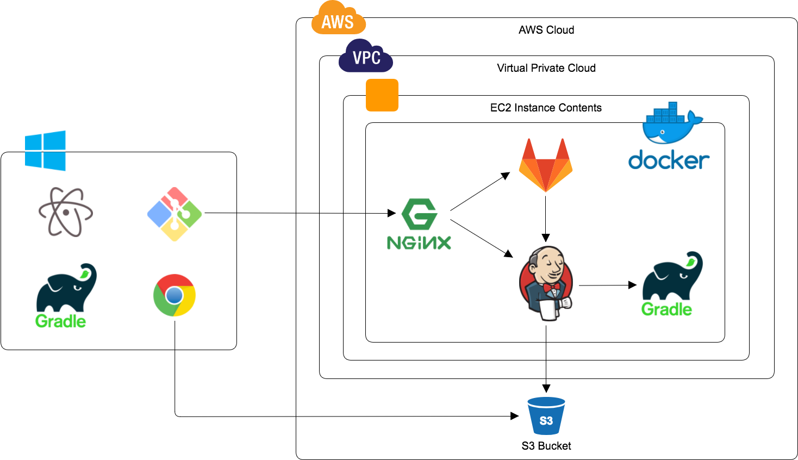
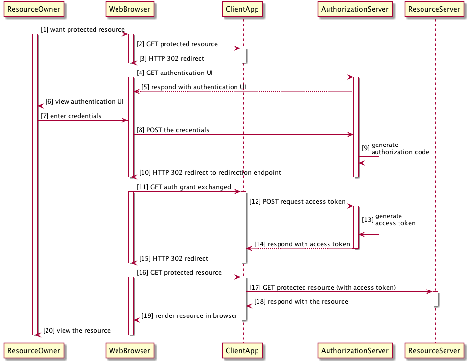
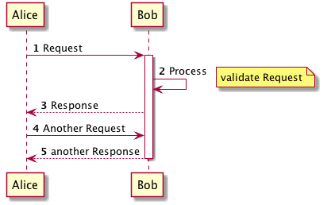

layout: true
<div class="my-footer"><span>JJUG CCC 2017 Fall #ccc_a1</span></div>


---
class: center, middle
# AsciiDocとPlantUMLで<br/>ドキュメント作成

???
本日の資料はホワイトボードに記載した短縮 URL で公開済み。

資料の都合上、フォントを大きくするにも限界がある。後方の方はお手元のデバイスで参照してほしい。

ハッシュタグは "ccc_a1" 


---
## Who am I?
- 梅澤 雄一郎 (うめざわ ゆういちろう)
  - @garbagetown  
  
- 試用期間中
  - 2017/10/31 某国内 SIer を退職
  - 2017/11/01 某外資系企業に転職
- 課外活動
  - Play Framework 関連で寄稿や登壇など

???
15 年間勤めた SIer を退職し、某外資系企業で試用期間中。  

とは言え SIer を悪く言うつもりはまったくない。  
SIer にもスキルの高い人は沢山いた。SIer でなければ経験できない大規模案件もあった。

なぜ転職したかについては懇親会で。

JJUG CCC の登壇は 2017 Spring に続いて 2 回目。

本日の発表内容は前職での経験に基づいたものであり、転職先とは一切関係ない。


---
## Questionnaire
- ドキュメント作成について
  - Microsoft Office, Wiki, マークアップ言語、etc.
- ドキュメント管理について
  - ファイルサーバ、Subversion, Git, etc.
- マークアップ言語について
  - Markdown, AsciiDoc, reStructuredText, Textile, etc.
- DSL について
  - PlantUML, GraphViz, Ditaa, etc.

???
(主に自分の) アイスブレイクを兼ねてバックグラウンドを確認。  

マークアップ言語も DSL だが、今回は便宜上、図形を描画するための記法を DSL と呼ぶ。


---
## Agenda
- ドキュメント作成と課題 <small>(5min)</small>
- Git, GitHub Flow <small>(5min)</small>
- AsciiDoc <small>(15min)</small>
- PlantUML <small>(5min)</small>
- Atom <small>(2min)</small>
- Gradle <small>(3min)</small>
- <s>Jenkins</s>
- まとめ <small>(5min)</small>

???
AsciiDoc の記法を手厚く紹介。既知の方は退屈かもしれないので別の部屋へ。

PlantUML はシーケンス図のみ。

時間の都合上、Jenkins は割愛。


---
class: center, middle
# ドキュメント作成と課題

???
まず、我々が立ち向かわなければならない課題の確認。


---
## 業務で作るドキュメント (例)

|工程|ドキュメント|ツール|
|-|-|-|
|要件定義|要件定義書|Word/PowerPoint|
|外部設計|業務フロー図|Excel|
|外部設計|システム構成図|PowerPoint|
|外部設計|ER図|Excel|
|外部設計|テーブル定義書|Excel|
|外部設計|外部仕様書|Word/Excel|
|内部設計|画面遷移図|Excel|
|内部設計|内部仕様書|Word/Excel|
|製造|コーディング規約|Word|
|単体試験|試験項目書|Excel|
|結合試験|試験項目書|Excel|

???
前職では大体こういうドキュメントをこういうツールで作った。

テーブル定義書と ER 図は ERMaster などで作ることもあった。


---
## 業務におけるドキュメント管理 (例)
- ファイルサーバ
- Subversion

???
格納先は大体ファイルサーバまたは Subversion だった。

業務で CVS を使ったことはない。VSS も見たことがない。

Team Foundation Server は聞いたことがあるが使ったことはない。


---
## ドキュメント作成の課題
- 不適切なバージョン管理
  - "bak" ディレクトリ
  - 日付ファイル名
- 不適切な履歴管理
  - "更新履歴" シート
  - 更新箇所は文字色変更
- 不適切な品質管理
  - レビューなしで保存/コミット

???
従前のドキュメント作成、管理には様々な課題がある。

まずバージョン管理。意外と事故頻度は低いものの、ルーチンワークで疲弊する。

次に履歴管理。更新履歴や diff 強調はツールに任せたい。
Wordの変更履歴は使いやすいと思えなかった。

続いて品質管理。レビューを通さないと品質を管理できないし、内容が属人化・暗黙知化され易い。

つらい思い出が多いので長くなった。


---
## ドキュメント作成の課題
- 本質的ではない作業
  - 罫線、フォント種別/サイズ、文字色、etc.
  - 図形の整列
  - 目次、章番号
- 生産性
  - ファイルロック
  - コンフリクト
  - "Microsoft Excel は動作を停止しました"

???
まだ課題がある。

構造と装飾を分離できないツールは本質的ではない作業が多く発生する。
技術ドキュメントで重要なのは構造と内容であり、装飾の重要性は低い。

Wordを正しく使えば一部の課題は解決する。

最後に生産性。バイナリフォーマットはバージョン管理ツールと相性が悪い。
現実問題として Excel は動作を停止し過ぎだと思う。これで現場は疲弊している。


---
## ドキュメント作成の課題解決 (例)
- 不適切なバージョン管理、履歴管理
  - Git
- 不適切な品質管理
  - GitHub Flow
- 本質的ではない作業
  - AsciiDoc, PlantUML
  - Atom
- 生産性
  - Gradle, Jenkins

???
これらの課題にこのように立ち向かった、という事例が今回の話。

バージョンと履歴は Git で管理。品質は GitHub Flow で管理。  
後述するが Git が重要なのでなく GitHub Flow が重要。
GitHub Flow を使うために Git を使う、という順序。

構造と装飾の分離、バージョン管理ツールとの相性については
AsciiDoc と PlantUML で解決。

マークアップ言語と DSL を導入することで、成果物がイメージしづらい、
ビルドの手間が掛かるという新たな課題が発生する。
これを Atom のプレビューと CI でカバー。


---
## ドキュメント作成環境



???
これらのツールを EC2 上に Docker Compose で構成した。
ここでは省略しているが JIRA, Nexus, SonarQube も活用している。

成果物は S3 で公開。

GitLab が 2.5GB, Nexus が 1GB くらいメモリを使うので t2.micro(1GB) では動かなかった。
t2.xlarge(16GB) で十分だが、t2.2xlarge(32GB) にスケールアップした。

なにかあってもすぐに対応できるのがクラウドのよいところ。


---
class: center, middle
# Git, GitHub Flow
<div class="timekeep">(ここで 10 分経過なら良いペース)</div>

???
個々の解決策について、具体的な内容を紹介する。

まず不適切なバージョン管理、履歴管理、品質管理の解決


---
## Git
- 分散型バージョン管理システム
  - ローカルコミットができる
  - やや学習コストが高い
- 強力な branch 機能
  - branch の作成、切り替えが高速
  - merge, rebase が簡単
- 様々なクライアント
  - Git for Windows, SourceTree, etc.


???
通常は常にオンラインなので、オフラインでも作業できるという利点はない。

branch を適切に活用して Git の利点を最大化する。

チーム開発の場合、初学者のケアとクライアントの考慮も必要。

merge/rebase のルールや conflict 解消手順などを定めるとよい。
ハンズオン形式で学習する時間を確保する。

どうしても GUI を使いたい場合は SourceTree がいいと思う。
EGit と TortoiseGit はおすすめしない。

個人的に CUI が好みで、特に oh-my-zsh のエイリアスを愛用。


---
## GitHub Flow
- branch モデルのひとつ
  - master を常にリリース可能な状態に保つ
  - PullRequest によるコミュニケーションの促進
- GitLab や GitBucket でも運用できる


???
ブランチ、PullRequest、マージのサイクルにより、master を常にリリース可能な状態に保ち、
必ずレビューを通す仕組みとする。

GitHub Flow が重要なので、Git 単体で導入しても効果は弱いと思う。

なお、正確な GitHub Flow は branch をデプロイして問題がないことを確認してからマージするが、
その点は簡略化し、master にマージしてからデプロイした。


---
class: center, middle
# AsciiDoc
<div class="timekeep">(ここで 15 分経過ならよいペース)</div>

???
次に本質的ではない作業の解決。


---
## AsciiDoc
- 軽量マークアップ言語のひとつ
  - Textile, Markdown, reStructuredText, etc
- Python 製
- Ruby 製の上位互換である Asciidoctor がある
  - JRuby による AsciidoctorJ もある
  - Maven/Gradle から利用可能

???
正確には Asciidoctor を利用。


---
## Why AsciiDoc ?


???
この著者は Read the Doc という reST サービスを作っている人なのでバイアスがかかっている
(と最後に断っている)。

個人的に Flavor については GFM が事実上の標準で良いと思う。
Asciidoctor も Asciidoc を拡張している。

Markdown では機能が不足していることが問題。


---
## Why AsciiDoc ?

||Markdown|AsciiDoc|　reST　|
|-|:-:|:-:|:-:|
|書き易さ|◎|◯|△|
|読み易さ|◎|◯|△|
|機能|△|◎|◎|
|ツール|◎|◯|△|

- Markdown は手放せない
  - 簡易なメモに最適
  - サポートするツール、サービスが多い
- AsciiDoc は Markdown より高機能
  - Markdown の文法と似ている

???
Markdown は機能が少ない。
複数ページに渡る資料を作るのがむずかしい。テーブルの機能は貧弱と言って差し支えないと思う。

reST は個人的に記法が馴染まなかった。
周辺ツールのサポートも AsciiDoc のほうが充実していると感じる。


---
## Spring Framework が採用


???
Java ユーザとして Spring Framework が Asciidoc を採用しているのは大きいと思う。


---
## Spring Framework が採用


???
余談だが Play1 のドキュメントは Textile, Play2 は Markdown で書かれている。


---
## Terasoluna Batch も採用


???
ちなみに AsciiDoc も万能ではない。

シングルページのドキュメントは簡単に作れるが、章ごとにページを分けるようなマルチページの
ドキュメントを作りたい場合は、章ごとの目次ページを手作業で作る必要がある。

Terasoluna Batch のドキュメントが非常に参考になる。
Terasoluna Batch は Maven を使っているので、Maven を使う場合はその点も参考になる。


---
## AsciiDoc (例)


???
AsciiDoc を使うと、このようなドキュメントを作成できる。

以下、理解を助けるために公式のドキュメントとは順序を入れ替えながら
記法と注意点を紹介する。


---
## Headers
```adoc
= Document Title (Level 0)
:author: yuichiro umezawa
:email: garbagetown@gmail.com
:revnumber: 1.0 
:revdate: 18th, Nov. 2017
```

- `=` で文書タイトルを示す
  - Level 0 は文書中でひとつしか使えない
- `:xxx:` は attribute
  - build.gradle でも指定できる

???
記法の説明として紹介するが、後述するように attribute は
build.gradle からビルドパラメータとして指定する方がメンテナンスし易いと思う。


---
## Table of Contents
```adoc
= Document Title (Level 0)
(snip)
:toc: left
:toclevels: 3
```
- `:toc:` で目次を生成
  - `left` で画面左側に目次ツリーを出力
- `:toclevels:` で目次を生成するレベルを指定
  - デフォルトは 2

???


---
## Include Directive
```adoc
= Document Title (Level 0)
(snip)
:leveloffset: +1
include::_chapter01.adoc[]

include::_chapter02.adoc[]
(snip)
:leveloffset: -1
```

- `include` で別ファイルの内容を取り込む
- Level 0 は文書中で一度しか使えないため、include するファイルの Level をひとつ下げる

???
include するファイルごとに leveloffset を指定することもできるが、
基本的にレベルをひとつ下げる目的以外に使わないため、一括で指定したほうが便利。

ファイル名の先頭をアンダースコアで始めるとビルド対象外になる。

include 同士の間は空行を含めた方が無難。


---
## Sections
```adoc
= Sections
== Level 1 Section Title
=== Level 2 Section Title
==== Level 3 Section Title
===== Level 4 Section Title
== Another Level 1 Section Title
```

- Markdown とほぼ同じ
  - Markdown 互換の `#` も使える
- Level が飛ぶとビルド時に WARNING

???
include する側で leveloffset を +1 しているので、
include される側の章・節・段落は Level 0 から書いてよい。


---
## example


???
Header と目次、Section を記載したファイルの include 結果。


---
## Auto Generated ID
```adoc
== Section Title

[[custom_id]]
== Another Section Title
```

- id を指定しない場合は自動生成される
  - prefix (`_`) が付与される
  - すべて小文字に変換
  - スペースなどの特殊文字は `_` に変換
- id を指定する場合は `[[xxx]]` のように書く

???
Section には id が自動生成される。自動生成ルールをカスタマイズすることも可能。

id が重複する場合は、`_2` のように suffix が付く。


---
## Cross References
```adoc
* <<Section Title>>
* <<_section_title>>
* <<custom_id,alias text>>
* <<_chapter02.adoc#_section_title,alias text>>
```
- `<<xxx>>` で id に対するリンクを生成
  - Section Title はそのまま指定できる
  - 自動生成された id またはカスタム id を指定する
  - `<<xxx,text>>` のようにリンク文字列を指定
  - 別ファイルの id も指定できる

???
エイリアスを指定しない場合は Section タイトルがリンク文字列になる。


---
## example


???
画像では分かりづらいが、それぞれのアンカーは "2.1. Section Title" へのリンク。


---
## Paragraph
```adoc
A paragraph is just one or more lines of consecutive text.

To begin a new paragraph, separate it 
by at least one blank line. +
Newlines within a paragraph are not displayed.
```
- Markdown とほぼ同じ
  - 通常の改行は無視
  - 空行で別段落
- `+` で改行できる

???
GFM も行末にスペースを 2 つ追加することで改行できるが、可読性が低い。


---
## Blocks
```adoc
.Gettysburg Address 
[quote, Abraham Lincoln, Address delivered at the ...]
____
Four score and seven years ago our fathers brought forth
on this continent a new nation...
____
```
- `____` や `----`, `====` などで囲ってブロックを指定
  - 各記号に意味がある。詳細は [ドキュメント](http://asciidoctor.org/docs/user-manual/#built-in-blocks-summary) 参照
- `.XXX` でタイトルを指定できる

???
ブロックタイトルはラベルや表、図につけることもできる。


---
## example


---
## Text Formatting
```adoc
* *bold phrase*
* _italic phrase_
* `monospace phrase`
* ^super^ script phrase
* ~sub~ script phrase
```
- `*_bold italic phrase_*` のように組み合わせも可能
- `a**b**c` のようにシンボルを連続することでスペースを省略できるが、記法が揺れるのでおすすめしない

???
GFM は `*` または `_` で斜体、 `**` または `__` で太字。分かりづらいと思う。

個人的に取り消し線は GFM の `~~xx~~` が直感的で好き


---
## Marks and Custom Styling
```adoc
* Werewolves are #allergic to cinnamon#.
* Where did all the [underline]#cores# run off to?
* We need [line-through]#ten# make that twenty VMs.
```
- `#` で囲むと `<mark>` タグでハイライト
- `[style]#xxx#` で組み込みのスタイルを指定

???
文字色や背景色の組み込みスタイルもあるが、構造と装飾が密結合するのでおすすめしない。


---
## example


---
## Unordered Lists
```adoc
* level 1
** level 2
*** level 3
**** level 4
***** level 5
* level 1
```
- Markdown とはシンボルと文法が異なる
  - インデント揺れ (スペース 2/4 個、タブ) がない
- リストスタイルを指定できるが、装飾機能の多用は禁物

???
Markdown のほうが記法と出力結果が近く直感的だが、
スペース2個、4個、タブ記号などで記法が揺れるので
Asciidoc のほうがよいと思う。

Markdown の `-` もトップレベルには使えるが、制限が多いのでおすすめしない。

square, circle, disc など指定できるが、多用は禁物。


---
## Ordered Lists
```adoc
. Step 1
. Step 2
.. Step 2a
.. Step 2b
. Step 3
```
- Markdown のように `1.`, `2.` と書くこともできる
  - 要素の増減に弱くなるので割り切ることをおすすめ
- 開始番号、昇順/降順、リストスタイルを指定できるが、装飾機能の多用は禁物

???
数字、先頭ゼロ埋め、大文字、小文字、ローマ数字など指定できるが、多用は禁物。


---
## example


---
## Labeled List
```adoc
first term:: definition of first term
second term:: definition of second term
```
- `<dt>` タグを出力する
  - 単語の定義リストなどを記述する際に便利


???
なんらかの定義を記述したい機会が意外と多かった。

箇条書きでは文言と内容の縦位置が揃わず、表では冗長な場合に重宝した。


---
class: center, middle

# 休憩
<div class="timekeep">(ここで 25 分経過ならよいペース)</div>

???
続いて AsciiDoc の本命機能であるテーブルを紹介する。


---
## Tables
```adoc
|=== 
| Cell in column 1, row 1 | Cell in column 2, row 1  
| Cell in column 1, row 2 | Cell in column 2, row 2
| Cell in column 1, row 3
| Cell in column 2, row 3
|=== 
```
- テーブルの区切りは `|===`
- セルの区切りは `|`
  - セルを改行して書くことができる
- 機能性、生産性、可読性のバランスが非常に良い

???
Markdown のテーブルはアスキーアートのようになりやすく、
可読性は高いが記述性、保守性が低い。

複雑な記法に見えるかもしれないが `|===` にも機能的な意味がある。
最初は割り切って覚えてしまうのがよい。

以下、紙面の関係から改行しない例も記述例を紹介するが
基本的に列ごとに改行し、行ごとに空行を含めることをおすすめする。


---
## Columns
```adoc
[cols="40,60"]
|===
|Cell in column 1, row 1 | Cell in column 2, row 1
|Cell in column 1, row 2 | Cell in column 2, row 2
|===
```
- セル幅を指定できる
  - `1,1` や `1*` のような指定もできる
  - 合計が 100 になるように指定するとわかりやすい


---
## example


???
上が幅指定なし、下が幅指定あり


---
## Formatting
```adoc
[cols="^20,.^20,^.^20,40a"]
|===
|align center | align middle | align center and middle
|This cell can contain Asciidoc format

* Unorderd List1
* Unorderd List2
|===
```
- `<`, `^`, `>` で horizontal align を指定
- `.<`, `.^`, `.>` で vertical align を指定
- AsciiDoc の文法を含める場合は `a` スタイルを指定

???
水平方向、垂直方向の位置指定もできるが、この辺りから可読性が厳しくなってくる。

前方に `.` を付けるとオプションの方向が変わるという仕様は個人的に覚えられない。
`h`, `v` を付ければ分かりやすいのではと思う。

`a` と指定することで、その列内に AsciiDoc の記法を含められる。表の列内に箇条書きしたい機会は非常に多く、重宝した。


---
## Cell Formatting
```adoc
[cols="30,30,40"]
|===
2+|colspan 2
.2+|rowspan 2
a|
* Unorderd List1
* Unorderd List2
|Cell in column 2, row 2
|===
```
- セル結合やセル単位のフォーマットも指定可能
  - 可読性が低下するのでおすすめしない

???
セル結合や、セル単位のフォーマットを指定することもできるが、この辺りで脳内コンパイルはほぼ不可能。

ここでも前方に `.` を付けるとオプションの方向が変わるという仕様は個人的に覚えられない。
`c`, `r` を付ければ分かりやすいのではと思う。

上記例がどのような表になるか考えてみてほしい。


---
## example


???
このような表になる。

align はまだしもセル結合が本当に必要かどうか疑問。費用対効果をよく考えて使うとよいと思う。


---
## Header/Footer
```adoc
[cols="40,60", options="header,footer"]
|===
|Name of Column 1        | Name of Column 2
|Cell in column 1, row 1 | Cell in column 2, row 1
|Footer of column 1      | Footer of column 2
|===
```
- `<thead>`, `<tfoot>` を出力できる

???
header はデフォルトで付けるとよい。footer は個人的には使わなかった。


---
## Delimiter-Separated Values
```adoc
[cols="30,30,40", options="header", format="csv"]
|===
Artist,Track,Genre
include::../csv/tracks.csv[]
|===
```
- CSV などのフォーマットも指定可能
- 外部ファイルの include も可能

???
CSV 以外に列デリミタをカスタマイズすることも可能。

`|===` にも意味があると前述したが、これは `|` をデリミタに使うという意味。
よく考えられた記法だと思うので、興味がある人はドキュメントを参照してほしい。

使う機会はなかったが、外部ファイル取り込みが便利な場面もあると思う。


---
## example


---
class: center, middle

# 休憩
<div class="timekeep">(ここで 28 分経過ならよいペース)</div>

???
もう少しだけ AsciiDoc の記法を紹介する。


---
## URLs
```adoc
* The homepage is http://www.asciidoctor.org.
* The homepage is http://www.asciidoctor.org[here].
```
- http, https, ftp, irc などを自動で判定してリンクを生成
- 別名を指定する際は `[xxx]` を付与する


???
Markdown より簡潔でよい。

余談だが、閲覧しているサイトの URL とタイトルをクリップボードにコピーする
ブラウザ拡張をインストールし、AsciiDoc 形式のルールを追加すると資料作りが捗る。

Chrome なら CreateLink, Firefox なら Make Link。


---
## Images
```adoc
image::sunset.jpg[Sunset,300,200]
```
- alt 文字列、width, height を指定できる


???
サイズを気軽に指定できるのはとても便利。

Markdown で図のサイズを指定する方法を調べると `img` タグを書けと言われてモニョる。


---
## Admonition
```adoc
[WARNING]
====
Wolpertingers are known to nest in server racks.
Enter at your own risk.
====
```
- `NOTE`, `TIP`, `IMPORTANT`, `CAUTION`, `WARNING` の 5 種類
- `NOTE: xxx` のように一行で書く記法もあるが、記法が<br/>揺れるのでブロック記法に統一することをおすすめ

???
Admonition は勧告、訓告といった意味。

ドキュメントに TIPS や参考情報、警告を記述する機会はとても多く、重宝した。


---
## example


???
上から `NOTE`, `TIP`, `IMPORTANT`, `CAUTION`, `WARNING`。

`NOTE` は参考情報、`TIP` はノウハウ、`CAUTION` は注意、`WARNING` は警告の意味で使った。

`IMPORTANT` は使わなかった。

アイコンをカスタマイズすることもできる。


---
## Syntax Highlighting Source Code
```adoc
= Document Title (Level 0)
:source-highlighter: coderay
[source,ruby]  
----
require 'sinatra'
get '/hi' do
  "Hello World!"
end
----
```
- 使用する `source-highlighter` を `coderay`, `highlightjs`, `prettify` から選択

???
coderay がサポートしているのは  
C, C++, Clojure, CSS, Delphi, diff, ERB, Go, Groovy, HAML, HTML, Java, 
JavaScript, JSON, Lua, PHP, Python, Ruby, Sass, SQL, Taskpaper, XML, YAML


---
## Code block inserted from another file
```adoc
[source,ruby]
----
include::../source/main.rb[lines="1,29..31,33..-1"]
----
```
- 外部ファイルの include も可能
- `lines` オプションで範囲を指定可能
  - `-1` は最終行


---
## example


---
## Callouts
```adoc
[source,ruby]
----
require 'sinatra'
get '/hi' do <1> <2>
  "Hello World!"
end
----
<1> URL mapping
<2> Response block
```
- ソースコードの説明に便利

???
最初はこの記法を知らずにテーブルを使った。

この記法にすることで生産性がとても向上した。


---
## example


???
ドラッグ時に選択されないよう style が指定されている


---
## Comments
```adoc
// A single-line comment.

////
A 
multi-line 
comment.
////
```
- 一行または複数行をコメントアウト

???
出力イメージは省略。


---
## Asciidoctor Diagram
```adoc
[plantuml, sequence_diagram, png]
....
// Write PlantUML here or
include::../uml/sequence_diagram.puml[]
....
```
- Asciidoctor の独自拡張機能。多数の DSL をサポート
- 外部ファイルの include も可能

???
この拡張により Asciidoc と PlantUML を組み合わせたドキュメントを作成できる。

サポートしている DSL は  
BlockDiag, Ditaa, GraphViz, Mermaid, PlantUML, Shaape, WaveDrom


---
class: center, middle
# PlantUML
<div class="timekeep">(ここで 30 分経過ならよいペース)</div>


---
## PlantUML
- 様々な UML を記載する DSL
  - ユースケース, アクティビティ, シーケンス, etc.
  - 記述性と可読性のバランスで採用可否を判断する
- Java 製
- 図形の表示に GraphViz を使う


---
## PlantUML (例)


???
以下、よく利用するシーケンス図について説明する。


---
## Sequence Diagram
```sh
Alice -> Bob: Request
Bob -> Bob: Process
Bob --> Alice: Response

Alice -> Bob: Another Request
Alice <-- Bob: another Response
```
- アクターを矢印 `->` で結びつける
  - 矢印の向きは任意
  - 自分自身に向けることもできる
- `:` に続けてメッセージを指定する
- `-->` と指定すると点線の矢印になる

???
各ライフラインを等間隔に並べる、自分自身の矢印で苦戦するなどの無駄がない。


---
## Lifeline
```sh
Alice -> Bob: Request
activate Bob
(snip)
Alice <-- Bob: another Response
deactivate Bob
```
- `activate` で活性化
- `deactivate` で破壊

???
長方形を載せたり、コネクタの接続で悩むなどの無駄がない。


---
## Numbering, Note
```sh
autonumber

Alice -> Bob: Request
activate Bob
Bob -> Bob: Process
note right: validate Request
(snip)
```
- `autonumber` で自動番号付け
  - 開始番号、増分、フォーマットなども指定できる
- `note` で注釈
  - `left`, `right` で表示位置を指定

???
この他にも複数行の記述、背景/文字色の変更、メッセージ間隔の指定など、
出力結果の様々な調整が可能。

構造と装飾の分離を意識しながら、必要最低限の機能を利用するとよい。


---
## example



---
class: center, middle
# Atom
<div class="timekeep">(ここで 35 分経過なら良いペース)</div>


---
## Atom
- GitHub が開発したオープンソースのエディタ
  - Git, GitHub との親和性が高い
- Electron 製なのでマルチプラットフォームで動作
- Packages で機能を拡張
  - マークアップ言語や DSL を WYSIWYG に編集

???
特定の OS に依存しない環境を重視するのは意外と重要。

構造と装飾を分離しない/できない人は、目で見ているものと成果物が一致しないと不安を覚える。
そういったメンバーを否定するのではなく、先回りして適切にケアすることが重要。


---
## Packages for Asciidoc
- [language-asciidoc](https://atom.io/packages/language-asciidoc)
    - asciidoc の文法をハイライト
- [asciidoc-preview](https://atom.io/packages/asciidoc-preview)
    - command + shift + A で preview
    - 実際に Asciidoctor が生成する成果物と微妙に細部が異なることに注意


---
## Packages for Asciidoc


???
include したファイルの内容もプレビューしてくれる


---
## Packages for PlantUML
- [language-plantuml](https://atom.io/packages/language-plantuml)
    - plantuml の文法をハイライト
- [plantuml-viewer](https://atom.io/packages/plantuml-viewer)
    - ctrl + option + P で preview
    - Java と GraphViz のインストールが必要


---
## Packages for PlantUML


---
class: center, middle
# Gradle
<div class="timekeep">(ここで 37 分経過なら良いペース)</div>


---
## Gradle
- JVM アプリケーションのビルドシステム
  - Ant, Maven, etc.
- Groovy でビルドスクリプトを記述
  - Maven よりも柔軟
- [asciidoctor-gradle-plugin](https://github.com/asciidoctor/asciidoctor-gradle-plugin) が提供されている


???
Asciidoctor は通常 ruby gem でビルドする。
Spring Framework は guard で自動ビルドしている模様。

Windows OS で Ruby 環境を構築するのは依然として敷居が高い印象。

AsciidoctorJ で Asciidoc をビルドする maven プラグイン、gradle プラグインが存在するので、
Windows OS で Java アプリケーションを開発する場合はこれらを利用すると良い。

以下、gradle プラグインの使い方を紹介する。


---
## Gradle
```adoc
project_root
├─ build.gradle
├─ settings.gradle
└─ src
    └─ docs
        └─ asciidoc
            ├─ images
            │   └─ xxx.jpg
            └─ xxx.adoc
```
- `.adoc` や画像ファイルの配置場所はカスタマイズ可能
- 成果物は `project_root/build/` 配下に出力される

???
asciidoctor-gradle-plugin のデフォルト値に沿ったディレクトリ階層。


---
## build.gradle
```gradle
buildscript {
  repositories {
    jcenter()
  }
  dependencies {
    classpath 'org.asciidoctor:asciidoctor-gradle-plugin:1.5.3'
    classpath 'org.asciidoctor:asciidoctorj-diagram:1.5.4.1'
    classpath 'org.asciidoctor:asciidoctorj-pdf:1.5.0-alpha.16'
  }
}
apply plugin: 'org.asciidoctor.convert'
// つづく
```

???
asciidoctorj-pdf がまだ alpha なので、環境によっては PDF が正しく生成されない場合がある。

発生した場合は alpha.10 程度まで落としてみるとよい。


---
## build.gradle
```gradle
// つづき
asciidoctorj {
  version = '1.5.6'
}
asciidoctor {
  backends = ['html5', 'pdf']
  requires = ['asciidoctor-diagram']
//  attributes {
//    'toc': 'left',
//    'toclevels': 3
//  }
}
```

???
デフォルトの `backends` は `html5` なので、PDF が必要ない場合は `backends` は省略可能。

PDF が必要な場合は、埋め込む画像ファイルを生成するために `html5` を先に実行する必要がある点に注意。

AsciiDoc の Header でも触れた通り、attribute は gradle 側で指定した方が小回りが効くと思う。
gradle で指定した場合、adoc 側の属性は上書きされる。


---
## Gradle
```sh
$ gradle clean asciidoctor

BUILD SUCCESSFUL in 10s
2 actionable tasks: 2 executed

$ ls build/asciidoc/html5                       
images    index.html

$ ls build/asciidoc/pdf 
images    index.pdf
```
- `asciidoctor` task で html, pdf を生成


---
class: center, middle
# まとめ
<div class="timekeep">(ここで 40 分経過なら良いペース)</div>


---
## ドキュメント作成と課題
- 従来のドキュメント作成には様々な課題がある
  - 不適切なバージョン管理
  - 不適切な履歴管理
  - 不適切な品質管理
  - 本質的ではない作業
  - 生産性
- これらの課題はいくつかのツールで解決できる
  - ツールを使うことは目的ではない
  - 課題を解決することが目的


---
## Git, GitHub Flow
- Git を使うことが目的ではない
  - GitHub Flow によるコミュニケーションの促進と<br/>品質管理が目的
  - GitLab, GitBucket などでも運用できる
- Git 初学者の不安を事前に取り除く
  - [サルでもわかるGit入門](https://www.backlog.jp/git-guide/) はチュートリアル形式で<br/>Git を学習できるのでおすすめ
  - GUI クライアントの操作手順書を用意する等


---
## AsciiDoc
- 正確には Ruby 製の上位互換である Asciidoctor
  - および JRuby による AsciidoctorJ
- Markdown と文法の近い高機能マークアップ言語
  - 表現力の高い Table
  - 外部ファイルの include
  - PlantUML のサポート
- Spring Framework が採用
- 記法揺れを防止するためにコーディング規約を設けると<br/>よい


---
## PlantUML
- Java と GraphViz による画像出力 DSL
- ユースケース図, アクティビティ図, シーケンス図に最適
- 構造と装飾を分離できない複雑な図は他のツールで描く
  - DSL を使うことが目的ではない
  - 課題を解決することが目的
- ひとつの画像ファイルを複数人で同時に編集する場合は [Cacoo](https://cacoo.com/ja/) という選択肢もある


---
## Atom
- GitHub 製マルチプラットフォームエディタ
  - Git との親和性が高い
- Packages で機能を拡張
  - AsciiDoc, PlantUML, etc.
- マークアップ言語や DSL を使うことで新たに発生する<br/>課題を解決する


---
## Gradle
- Maven よりも記述量が少なく柔軟
- asciidoctor-gradle-plugin で Windows でも簡単に Asciidoctor をビルド
- asciidoctorj-diagram で PlantUML をビルド
- asciidoctorj-pdf で PDF 生成
  - まだ alpha 版であることに注意
  - PDF を生成する前に PlantUML をビルドする


---
class: center, middle
# Enjoy Documenting<br/>with<br/>AsciiDoc & PlantUML!!


---
class: center, middle
# Thank you :-)


---
## Links
- <small>[Git Version Control - Contributing to GitHub Projects (3) - Tricks of the Trades](http://www.tricksofthetrades.net/2016/04/26/github-flow/)</small>
- <small>[Why You Shouldn’t Use “Markdown” for Documentation](http://ericholscher.com/blog/2016/mar/15/dont-use-markdown-for-technical-docs/)</small>
- <small>[Asciidoctor User Manual](http://asciidoctor.org/docs/user-manual/#building-a-document)</small>
- <small>[v5\-guideline/src/main/asciidoc/ja at master · terasoluna\-batch/v5\-guideline · GitHub](https://github.com/terasoluna-batch/v5-guideline/tree/master/src/main/asciidoc/ja)</small>
- <small>[AsciiDoc入門 - Qiita](https://qiita.com/xmeta/items/de667a8b8a0f982e123a)</small>
- <small>[シーケンス図の構文と機能](http://plantuml.com/sequence-diagram)</small>
- <small>[AsciiDoc と PlantUML と mermaid.js で素敵なテキストベース仕様書ライフ](https://ryuta46.com/112)</small>
- <small>[図入りのAsciiDoc記述からPDFを生成する環境をGradleで簡単に用意する - Qiita](https://qiita.com/tokumoto/items/d37ab3de5bdbee307769)</small>
